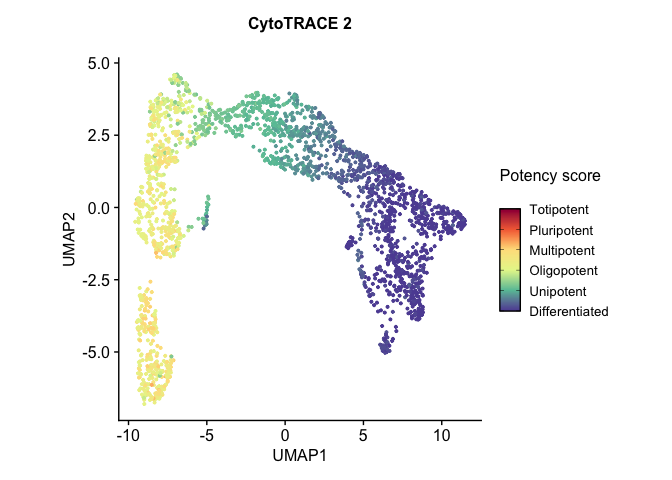
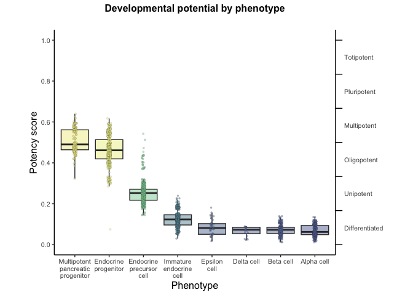
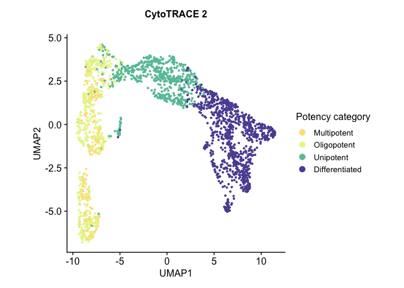
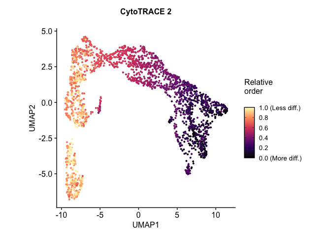
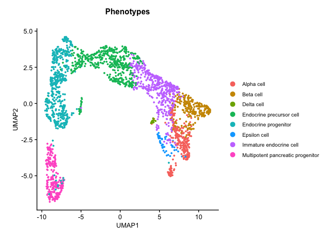
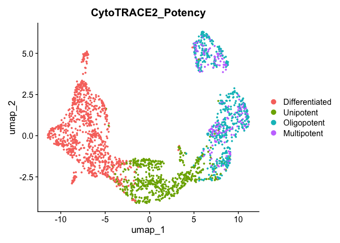
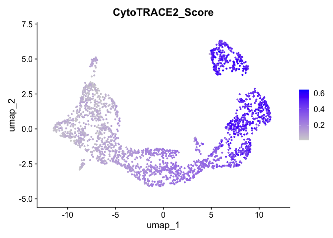

## CytoTRACE2

CytoTRACE2是 [Newman Lab](https://anlab.stanford.edu/) 开发的用于预测scRNA-seq数据中细胞干性和发育潜能的计算方法。

CytoTRACE2本质是一种深度学习框架，该模型在涵盖 28 种组织类型和整个发育范围的人类和小鼠 scRNA-seq 数据集的训练和验证（总共31个数据）。利用该模型，CytoTRACE2可以将细胞分类为终末分化（differentiated: 0）和全能细胞（totipotent: 1）.


本文简单介绍CytoTRACE2 R包的基本用法，具体原理可参考他们目前的预印本 <https://doi.org/10.1101/2024.03.19.585637>

## 安装

```r
devtools::install_github("digitalcytometry/cytotrace2", subdir = "cytotrace2_r") #installing
```

## 数据准备

CytoTRACE2需要的输入数据包括单细胞表达数据，这里利用一个已发表的胰腺的10X scRNA-seq作为示例 （[Bastidas-Ponce et al., 2019](https://doi.org/10.1242/dev.173849)）

这里下载CytoTRACE2提供的示例数据集，包括了：

-   表达数据（`expression_data`）：小鼠胰腺上皮的2280细胞的10X scRNA-seq数据。该数据已经进行归一化处理

-   注释数据（`annotation`）：表型注释

<!-- -->

```r
# download the .rds file (this will download the file to your working directory)
download.file("https://drive.google.com/uc?export=download&id=1ivi9TBlmzVTDGzNWQrXXeyL68Wug989K", "Pancreas_10x_downsampled.rds")
```

## 运行CytoTRACE2

运行 `cytotrace2()` 进行细胞干性推断，函数运行时执行以下操作：

1.  预处理数据：在每个细胞中对表达数据进行降序排序，使用排序后的秩（rank）进行预测

2.  预测细胞发育状态：读入模型预训练参数进行预测
    > ```{r}    
    >     # full model
    >     parameter_dict <- readRDS(system.file("extdata", "parameter_dict_17.rds", package = "CytoTRACE2"))
    >     # else 
    >     parameter_dict <- readRDS(system.file("extdata", "parameter_dict_5_best.rds", package = "CytoTRACE2"))
    > ```

3.  后处理预测结果：利用diffusion方法平滑预测值，并利用kNN和binning的方法重新正则化预测值

<!-- -->

```r
library(CytoTRACE2) #loading

## Loading required package: data.table

## Loading required package: doParallel

## Loading required package: foreach

## Loading required package: iterators

## Loading required package: parallel

## Loading required package: dplyr

## 
## Attaching package: 'dplyr'

## The following objects are masked from 'package:data.table':
## 
##     between, first, last

## The following objects are masked from 'package:stats':
## 
##     filter, lag

## The following objects are masked from 'package:base':
## 
##     intersect, setdiff, setequal, union

## Loading required package: ggplot2

## Loading required package: HiClimR

## Loading required package: magrittr

## Loading required package: Matrix

## Loading required package: plyr

## ------------------------------------------------------------------------------

## You have loaded plyr after dplyr - this is likely to cause problems.
## If you need functions from both plyr and dplyr, please load plyr first, then dplyr:
## library(plyr); library(dplyr)

## ------------------------------------------------------------------------------

## 
## Attaching package: 'plyr'

## The following objects are masked from 'package:dplyr':
## 
##     arrange, count, desc, failwith, id, mutate, rename, summarise,
##     summarize

## Loading required package: RANN

## Loading required package: Rfast

## Loading required package: Rcpp

## Loading required package: RcppZiggurat

## Loading required package: RcppParallel

## 
## Attaching package: 'RcppParallel'

## The following object is masked from 'package:Rcpp':
## 
##     LdFlags

## 
## Rfast: 2.1.0

##  ___ __ __ __ __    __ __ __ __ __ _             _               __ __ __ __ __     __ __ __ __ __ __   
## |  __ __ __ __  |  |  __ __ __ __ _/            / \             |  __ __ __ __ /   /__ __ _   _ __ __\  
## | |           | |  | |                         / _ \            | |                        / /          
## | |           | |  | |                        / / \ \           | |                       / /          
## | |           | |  | |                       / /   \ \          | |                      / /          
## | |__ __ __ __| |  | |__ __ __ __           / /     \ \         | |__ __ __ __ _        / /__/\          
## |    __ __ __ __|  |  __ __ __ __|         / /__ _ __\ \        |_ __ __ __ _   |      / ___  /           
## |   \              | |                    / _ _ _ _ _ _ \                     | |      \/  / /       
## | |\ \             | |                   / /           \ \                    | |         / /          
## | | \ \            | |                  / /             \ \                   | |        / /          
## | |  \ \           | |                 / /               \ \                  | |       / /          
## | |   \ \__ __ _   | |                / /                 \ \     _ __ __ __ _| |      / /          
## |_|    \__ __ __\  |_|               /_/                   \_\   /_ __ __ __ ___|      \/             team

## 
## Attaching package: 'Rfast'

## The following object is masked from 'package:dplyr':
## 
##     nth

## The following object is masked from 'package:data.table':
## 
##     transpose

## Loading required package: Seurat

## Loading required package: SeuratObject

## Loading required package: sp

## 'SeuratObject' was built under R 4.4.0 but the current version is
## 4.4.1; it is recomended that you reinstall 'SeuratObject' as the ABI
## for R may have changed

## 
## Attaching package: 'SeuratObject'

## The following objects are masked from 'package:base':
## 
##     intersect, t

## Loading required package: stringr

## Warning: replacing previous import 'data.table::first' by 'dplyr::first' when
## loading 'CytoTRACE2'

## Warning: replacing previous import 'data.table::last' by 'dplyr::last' when
## loading 'CytoTRACE2'

## Warning: replacing previous import 'data.table::between' by 'dplyr::between'
## when loading 'CytoTRACE2'

# load rds
scdata <- readRDS("Pancreas_10x_downsampled.rds")

# extract expression data
expression_data <- scdata$expression_data
dim(expression_data)

## [1] 17326  2280

# running CytoTRACE 2 main function - cytotrace2 - with default parameters
cytotrace2_result <- cytotrace2(expression_data, 
                                species = 'mouse',
                                is_seurat = F)

## cytotrace2: Started loading data

## Dataset contains 17326 genes and 2280 cells.

## The passed subsample size is greater than the number of cells in dataset.
## Now setting subsample size to 2280

## cytotrace2: Running on 1 subsample(s) approximately of length 2280

## cytotrace2: Started running on subsample(s). This will take a few minutes.

## cytotrace2: Started preprocessing.

## 13191 input genes mapped to model genes.

## cytotrace2: Started prediction.

## This section will run using  5 / 11 core(s).

## cytotrace2: Started postprocessing.

## cytotrace2: Running with fast mode (subsamples are processed in parallel)

## This section will run on 2 sub-sample(s) of approximately 1140 cells each using 2 / 11 core(s).

## cytotrace2: Finished

# extract annotation data
annotation <- scdata$annotation
head(annotation)

##                        phenotype1 phenotype2        potency
## CACCAGGCAGGTGCCT-1-0   Alpha cell      Alpha Differentiated
## CCCAGTTAGGGAACGG-1-2   Alpha cell      Alpha Differentiated
## CGGACTGCATCTACGA-1-2 Epsilon cell    Epsilon Differentiated
## TACCTTAGTTCCAACA-1-2   Alpha cell      Alpha Differentiated
## TACTTACCAGACAGGT-1-2   Alpha cell      Alpha Differentiated
## ATGAGGGGTGGTACAG-1-3    Beta cell       Beta Differentiated
##                      absolute_granular_ordering relative_ordering
## CACCAGGCAGGTGCCT-1-0                         23                 6
## CCCAGTTAGGGAACGG-1-2                         23                 6
## CGGACTGCATCTACGA-1-2                         23                 6
## TACCTTAGTTCCAACA-1-2                         23                 6
## TACTTACCAGACAGGT-1-2                         23                 6
## ATGAGGGGTGGTACAG-1-3                         23                 6

# generate prediction and phenotype association plots with plotData function
plots <- plotData(cytotrace2_result = cytotrace2_result, 
                  annotation = annotation,
                  expression_data = expression_data
                  )

## Preparing input for visualization.

## Creating plots.

## Done. You can access any plot directly from the returned list by '$' operator (i.e. plots$CytoTRACE2_Potency_UMAP).

table(annotation$phenotype1)

## 
##                        Alpha cell                         Beta cell 
##                               276                               258 
##                        Delta cell          Endocrine precursor cell 
##                                20                               509 
##              Endocrine progenitor                      Epsilon cell 
##                               499                                46 
##           Immature endocrine cell Multipotent pancreatic progenitor 
##                               427                               245

table(cytotrace2_result$CytoTRACE2_Potency)

## 
## Differentiated      Unipotent    Oligopotent    Multipotent    Pluripotent 
##            952            598            501            229              0 
##     Totipotent 
##              0

plots$CytoTRACE2_UMAP
```



### ***Potency score distribution by phenotype***

```r
plots$CytoTRACE2_Boxplot_byPheno
```



### ***Potency category***

```r
plots$CytoTRACE2_Potency_UMAP
```



### ***Relative order***

```r
plots$CytoTRACE2_Relative_UMAP
```



### Phenotype

```r
plots$Phenotype_UMAP
```



### Seurat object input

```r
library(Seurat)
seu <- CreateSeuratObject(expression_data, meta.data = annotation)

## Warning: Data is of class data.frame. Coercing to dgCMatrix.

seu

## An object of class Seurat 
## 17326 features across 2280 samples within 1 assay 
## Active assay: RNA (17326 features, 0 variable features)
##  1 layer present: counts
```

run cytotrace2

```r
cytotrace2_result <- cytotrace2(seu, is_seurat = TRUE, slot_type = "counts", species = 'mouse')

## cytotrace2: Started loading data

## Dataset contains 17326 genes and 2280 cells.

## The passed subsample size is greater than the number of cells in dataset.
## Now setting subsample size to 2280

## cytotrace2: Running on 1 subsample(s) approximately of length 2280

## cytotrace2: Started running on subsample(s). This will take a few minutes.

## cytotrace2: Started preprocessing.

## 13191 input genes mapped to model genes.

## cytotrace2: Started prediction.

## This section will run using  5 / 11 core(s).

## cytotrace2: Started postprocessing.

## cytotrace2: Running with fast mode (subsamples are processed in parallel)

## This section will run on 2 sub-sample(s) of approximately 1140 cells each using 2 / 11 core(s).

## cytotrace2: Finished

# plotting
plots <- plotData(cytotrace2_result = cytotrace2_result, 
                  annotation = annotation, 
                  is_seurat = TRUE)

## Preparing input for visualization.

## Creating plots.

## Done. You can access any plot directly from the returned list by '$' operator (i.e. plots$CytoTRACE2_Potency_UMAP).
```

可视化

```r
plots$CytoTRACE2_Potency_UMAP
```


也可以用seurat流程跑完后的对象进行UMAP可视化

```r
# Normalize the data
cytotrace2_result <- NormalizeData(cytotrace2_result)

## Normalizing layer: counts

# Find variable features
cytotrace2_result <- FindVariableFeatures(cytotrace2_result, selection.method = "vst", nfeatures = 2000)

## Finding variable features for layer counts

all.genes <- rownames(cytotrace2_result)
# Scale the data
cytotrace2_result <- ScaleData(cytotrace2_result, features=all.genes)

## Centering and scaling data matrix

# Perform PCA
cytotrace2_result <- RunPCA(cytotrace2_result, npcs = 30)

## PC_ 1 
## Positive:  Cpe, Pcsk1n, Pax6, Chga, Fam183b, Hmgn3, Chgb, Scg3, Map1b, Cryba2 
##     Isl1, Slc38a5, Neurod1, Prnp, Gnao1, Scgn, Gnas, Gch1, Aplp1, Fev 
##     Dbpht2, Pcsk2, Vwa5b2, Pyy, Pam, Pim2, Cnih2, Mafb, Abcc8, Tspan7 
## Negative:  H19, Wfdc2, Tead2, Sparc, Smco4, Phgdh, Rbp1, Rpl36a, Cd24a, Mgst1 
##     Adamts1, 1700011H14Rik, Gsta3, Stmn1, Ldha, Rpl39, Hmga2, Spp1, Ptn, Rpl12 
##     Galk1, Wfdc15b, Cdkn1c, Sox9, Serpinh1, Sox4, Habp2, Hes1, Vim, Rps12 
## PC_ 2 
## Positive:  Btbd17, Ppp1r14a, Gadd45a, Neurod2, Igfbpl1, Sult2b1, Mfng, Neurog3, Pax4, Tubb3 
##     Btg2, Mfap4, Smarcd2, Tmsb4x, Plk3, Cbfa2t3, Cck, Notum, Actg1, Hes6 
##     Sulf2, Lynx1, Gfra3, Epb42, Lingo1, Gdpd1, Foxa3, Cdc14b, Hpca, Rcor2 
## Negative:  Atp1b1, Rbp4, Tagln2, Tuba1b, Akr1c19, Id2, Gcsh, Fxyd6, Rnase4, Bex4 
##     1700011H14Rik, Tmem27, Siva1, Phgdh, Tubb2a, Meis2, Cmtm8, Mgst3, Ociad2, Crip1 
##     Adamts1, Parm1, Fkbp2, Fabp3, Id3, Eif4ebp1, Spc25, Sdc4, Cpn1, Cyr61 
## PC_ 3 
## Positive:  Rpl13a, Rpl14, Rps14, mt-Atp6, Eef1a1, Rpl10, Rpl41, Ftl1, mt-Co3, Rps16 
##     Rps18, Rps27a, Rps3a1, Rpl26, mt-Cytb, Rps6, mt-Nd1, Rpl13, Rpl11, Rpl6 
##     Rpl9, mt-Co1, Rps5, Rps7, Ppia, Rps2, Rpl17, Rplp0, Rps9, Rpl32 
## Negative:  Neurog3, Anxa2, Sparc, Col9a3, Col9a1, Fxyd2, Amotl2, Mpc1, Aurka, Tpx2 
##     Cotl1, Ckb, Cenpf, Gpx2, Mia, Spp1, Cd82, Cdk2ap1, Cdc20, Lurap1l 
##     Pbk, Gsta3, Racgap1, Hmmr, Cxcl12, Aurkb, Ccnb1, Aldh1b1, Tpm1, Tpm4 
## PC_ 4 
## Positive:  Cldn4, Runx1t1, Fev, Irf2bpl, Cacna2d1, Hnrnpa1, Pdk3, Slc35d3, Grb10, Gm43861 
##     Akr1c19, Jun, 1110012L19Rik, BC023829, Glud1, Vdr, Tm4sf4, Emb, St18, Celf3 
##     Pgf, Ids, Pcyt1b, Cited2, Maff, Elavl4, Sulf1, Neurod1, Serpini1, Ddc 
## Negative:  Ppp1r1a, Iapp, Pdia6, Scg2, Calr, Ttr, Higd1a, G6pc2, Tmed3, Tmsb15l 
##     Papss2, Sdf2l1, Hspa5, Clu, Ins1, Tmem27, Ly6e, Cd82, Slc30a8, Dap 
##     Igfbp7, Ins2, Ociad2, Gcg, Ttc28, Qsox1, Bcl2, Gapdh, Irx1, Npy 
## PC_ 5 
## Positive:  Cxcl12, Pdzk1ip1, Anxa2, Grin3a, Dcdc2a, Krt18, 8430408G22Rik, Pamr1, Anxa5, Bicc1 
##     Capg, Muc1, Krt8, Krt7, S100a10, Cldn3, Cystm1, Spp1, Gsta3, Trim47 
##     Smoc2, Ppp1r1b, Col9a3, Vim, Ndrg2, Tsc22d1, Cat, Cldn4, Txnip, Nfib 
## Negative:  Vtn, 2810417H13Rik, Hist1h2ap, Chst2, Tuba1a, Top2a, P2rx1, Aurkb, Rrm2, Fbxo5 
##     Ccna2, Cpn1, Spc25, H2afz, Cenpf, Birc5, Ccnb1, Pbk, Gcat, Smc2 
##     Ube2c, Incenp, Mki67, Car14, Rad51ap1, Gc, Cdk1, Plk1, Prc1, Smc4

# Find neighbors
cytotrace2_result <- FindNeighbors(cytotrace2_result, dims = 1:20)

## Computing nearest neighbor graph

## Computing SNN

# Find clusters
cytotrace2_result <- FindClusters(cytotrace2_result, resolution = 0.1)

## Modularity Optimizer version 1.3.0 by Ludo Waltman and Nees Jan van Eck
## 
## Number of nodes: 2280
## Number of edges: 73179
## 
## Running Louvain algorithm...
## Maximum modularity in 10 random starts: 0.9505
## Number of communities: 4
## Elapsed time: 0 seconds

# Run UMAP
cytotrace2_result <- RunUMAP(cytotrace2_result, dims = 1:20)

## 14:12:35 UMAP embedding parameters a = 0.9922 b = 1.112

## 14:12:35 Read 2280 rows and found 20 numeric columns

## 14:12:35 Using Annoy for neighbor search, n_neighbors = 30

## 14:12:35 Building Annoy index with metric = cosine, n_trees = 50

## 0%   10   20   30   40   50   60   70   80   90   100%

## [----|----|----|----|----|----|----|----|----|----|

## **************************************************|
## 14:12:35 Writing NN index file to temp file /var/folders/yk/896pglhn555drshbgn27f71h0000gn/T//RtmpD9l2F4/file95af46be469e
## 14:12:35 Searching Annoy index using 1 thread, search_k = 3000
## 14:12:35 Annoy recall = 100%
## 14:12:35 Commencing smooth kNN distance calibration using 1 thread with target n_neighbors = 30
## 14:12:35 Initializing from normalized Laplacian + noise (using RSpectra)
## 14:12:35 Commencing optimization for 500 epochs, with 87006 positive edges
## 14:12:37 Optimization finished

DimPlot(cytotrace2_result, group.by = 'CytoTRACE2_Potency')
```



或者看score的分布

```r
FeaturePlot(cytotrace2_result, features = 'CytoTRACE2_Score')
```



> Ref:
>
> <https://github.com/digitalcytometry/cytotrace2/tree/main>
>
> <https://www.biorxiv.org/content/10.1101/2024.03.19.585637v1.full>
