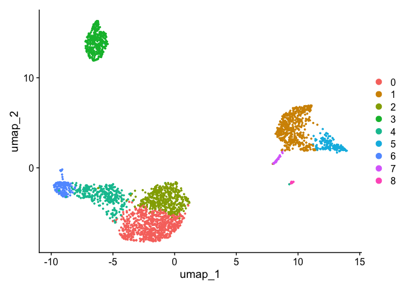
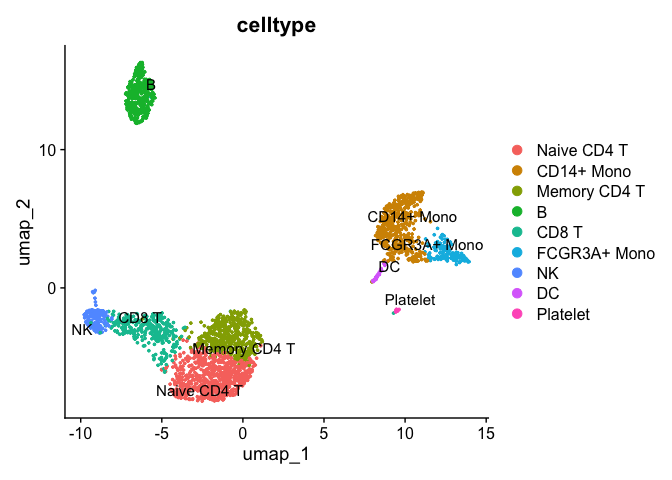
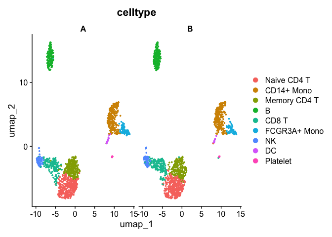
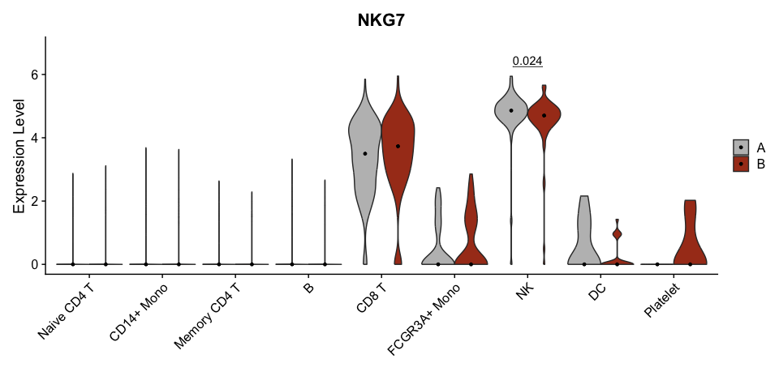
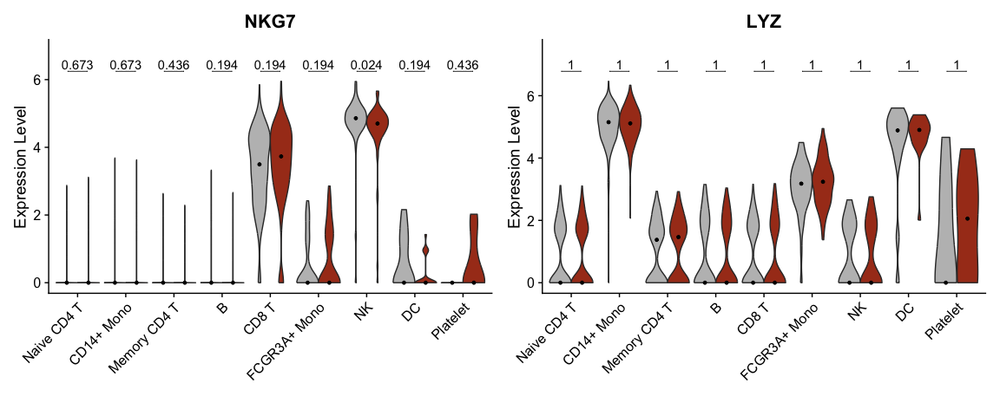

最近使用Seurat画小提琴图时想将组间的p值给标上，发现Seurat的VlnPlot并没有参数直接支持这个功能。本文就记录一下解决的方案。

## Data preprocessing

这里用pbmc的数据作为示例

```r
library(Seurat)

## Loading required package: SeuratObject

## Loading required package: sp

## 'SeuratObject' was built under R 4.4.0 but the current version is
## 4.4.1; it is recomended that you reinstall 'SeuratObject' as the ABI
## for R may have changed

## 
## Attaching package: 'SeuratObject'

## The following objects are masked from 'package:base':
## 
##     intersect, t

library(ggplot2)

# Load the PBMC dataset
pbmc.data <- Read10X(data.dir = "data/filtered_gene_bc_matrices/hg19/")
# Initialize the Seurat object with the raw (non-normalized data).
pbmc <- CreateSeuratObject(counts = pbmc.data, project = "pbmc3k", min.cells = 3, min.features = 200)

## Warning: Feature names cannot have underscores ('_'), replacing with dashes
## ('-')

pbmc

## An object of class Seurat 
## 13714 features across 2700 samples within 1 assay 
## Active assay: RNA (13714 features, 0 variable features)
##  1 layer present: counts

pbmc <- NormalizeData(object = pbmc)

## Normalizing layer: counts

pbmc <- FindVariableFeatures(object = pbmc)

## Finding variable features for layer counts

pbmc <- ScaleData(object = pbmc)

## Centering and scaling data matrix

pbmc <- RunPCA(object = pbmc)

## PC_ 1 
## Positive:  MALAT1, LTB, IL32, CD2, ACAP1, STK17A, CTSW, CD247, CCL5, GIMAP5 
##     AQP3, GZMA, CST7, TRAF3IP3, MAL, HOPX, ITM2A, GZMK, MYC, BEX2 
##     GIMAP7, ETS1, LDLRAP1, ZAP70, LYAR, RIC3, TNFAIP8, KLRG1, SAMD3, NKG7 
## Negative:  CST3, TYROBP, LST1, AIF1, FTL, FCN1, LYZ, FTH1, S100A9, FCER1G 
##     TYMP, CFD, LGALS1, CTSS, S100A8, SERPINA1, LGALS2, SPI1, IFITM3, PSAP 
##     CFP, SAT1, IFI30, COTL1, S100A11, NPC2, LGALS3, GSTP1, PYCARD, NCF2 
## PC_ 2 
## Positive:  CD79A, MS4A1, TCL1A, HLA-DQA1, HLA-DRA, HLA-DQB1, LINC00926, CD79B, HLA-DRB1, CD74 
##     HLA-DPB1, HLA-DMA, HLA-DQA2, HLA-DRB5, HLA-DPA1, HLA-DMB, FCRLA, HVCN1, LTB, BLNK 
##     KIAA0125, P2RX5, IRF8, IGLL5, SWAP70, ARHGAP24, SMIM14, PPP1R14A, FCRL2, C16orf74 
## Negative:  NKG7, PRF1, CST7, GZMA, GZMB, FGFBP2, CTSW, GNLY, GZMH, SPON2 
##     CCL4, FCGR3A, CCL5, CD247, XCL2, CLIC3, AKR1C3, SRGN, HOPX, CTSC 
##     TTC38, S100A4, ANXA1, IL32, IGFBP7, ID2, ACTB, XCL1, APOBEC3G, SAMD3 
## PC_ 3 
## Positive:  HLA-DQA1, CD79A, CD79B, HLA-DQB1, HLA-DPB1, CD74, HLA-DPA1, MS4A1, HLA-DRB1, HLA-DRB5 
##     HLA-DRA, HLA-DQA2, TCL1A, LINC00926, HLA-DMB, HLA-DMA, HVCN1, FCRLA, IRF8, BLNK 
##     KIAA0125, SMIM14, PLD4, IGLL5, P2RX5, TMSB10, SWAP70, LAT2, MALAT1, IGJ 
## Negative:  PPBP, PF4, SDPR, SPARC, GNG11, NRGN, GP9, RGS18, TUBB1, CLU 
##     HIST1H2AC, AP001189.4, ITGA2B, CD9, TMEM40, CA2, PTCRA, ACRBP, MMD, TREML1 
##     NGFRAP1, F13A1, RUFY1, SEPT5, MPP1, CMTM5, TSC22D1, MYL9, RP11-367G6.3, GP1BA 
## PC_ 4 
## Positive:  HLA-DQA1, CD79A, CD79B, HIST1H2AC, HLA-DQB1, PF4, MS4A1, SDPR, CD74, PPBP 
##     HLA-DPB1, GNG11, HLA-DQA2, SPARC, HLA-DRB1, HLA-DPA1, GP9, TCL1A, HLA-DRA, LINC00926 
##     NRGN, RGS18, HLA-DRB5, PTCRA, CD9, AP001189.4, CA2, CLU, TUBB1, ITGA2B 
## Negative:  VIM, S100A8, S100A6, S100A4, S100A9, TMSB10, IL32, GIMAP7, LGALS2, S100A10 
##     RBP7, FCN1, MAL, LYZ, S100A12, MS4A6A, CD2, FYB, S100A11, FOLR3 
##     GIMAP4, AQP3, ANXA1, AIF1, MALAT1, GIMAP5, IL8, IFI6, TRABD2A, TMSB4X 
## PC_ 5 
## Positive:  GZMB, FGFBP2, NKG7, GNLY, PRF1, CCL4, CST7, SPON2, GZMA, CLIC3 
##     GZMH, XCL2, CTSW, TTC38, AKR1C3, CCL5, IGFBP7, XCL1, CCL3, S100A8 
##     TYROBP, HOPX, CD160, HAVCR2, S100A9, FCER1G, PTGDR, LGALS2, RBP7, S100A12 
## Negative:  LTB, VIM, AQP3, PPA1, MAL, KIAA0101, CD2, CYTIP, CORO1B, FYB 
##     IL32, TRADD, ANXA5, TUBA1B, HN1, TYMS, PTGES3, ITM2A, COTL1, GPR183 
##     TNFAIP8, ACTG1, TRAF3IP3, ATP5C1, GIMAP4, ZWINT, PRDX1, LDLRAP1, ABRACL, NGFRAP1

pbmc <- FindNeighbors(object = pbmc, dims = 1:10)

## Computing nearest neighbor graph

## Computing SNN

pbmc <- FindClusters(object = pbmc, resolution = 0.5)

## Modularity Optimizer version 1.3.0 by Ludo Waltman and Nees Jan van Eck
## 
## Number of nodes: 2700
## Number of edges: 97892
## 
## Running Louvain algorithm...
## Maximum modularity in 10 random starts: 0.8719
## Number of communities: 9
## Elapsed time: 0 seconds

pbmc <- RunUMAP(object = pbmc, dims = 1:10)

## Warning: The default method for RunUMAP has changed from calling Python UMAP via reticulate to the R-native UWOT using the cosine metric
## To use Python UMAP via reticulate, set umap.method to 'umap-learn' and metric to 'correlation'
## This message will be shown once per session

## 11:53:34 UMAP embedding parameters a = 0.9922 b = 1.112

## 11:53:34 Read 2700 rows and found 10 numeric columns

## 11:53:34 Using Annoy for neighbor search, n_neighbors = 30

## 11:53:34 Building Annoy index with metric = cosine, n_trees = 50

## 0%   10   20   30   40   50   60   70   80   90   100%

## [----|----|----|----|----|----|----|----|----|----|

## **************************************************|
## 11:53:34 Writing NN index file to temp file /var/folders/yk/896pglhn555drshbgn27f71h0000gn/T//Rtmp5Rftbq/file1d9d31ab7c3e
## 11:53:34 Searching Annoy index using 1 thread, search_k = 3000
## 11:53:34 Annoy recall = 100%
## 11:53:35 Commencing smooth kNN distance calibration using 1 thread with target n_neighbors = 30
## 11:53:35 Initializing from normalized Laplacian + noise (using RSpectra)
## 11:53:35 Commencing optimization for 500 epochs, with 107868 positive edges
## 11:53:37 Optimization finished

DimPlot(object = pbmc, reduction = "umap")
```



根据seurat提供的注释对cluster命名

```r
pbmc <- RenameIdents(pbmc,
                     '0' = 'Naive CD4 T',
                     '1' = 'CD14+ Mono',
                     '2' = 'Memory CD4 T',
                     '3' = 'B',
                     '4' = 'CD8 T',
                     '5' = 'FCGR3A+ Mono',
                     '6' = 'NK',
                     '7' = 'DC',
                     '8' = 'Platelet'
)

pbmc$celltype <- Idents(pbmc)
DimPlot(pbmc, group.by = 'celltype', label = T, repel = T)
```



## Comparison between group

假设我们想比较每个细胞类型中某个基因在两组间的差异，我们可以首先给pbmc数据随机创建一个分组A和B

```r
group1 <- rep('A', nrow(pbmc@meta.data))
set.seed(233)
idx <- sample(1:nrow(pbmc@meta.data), nrow(pbmc@meta.data)/2)
group1[idx] <- 'B'

pbmc$group <- group1

DimPlot(pbmc, group.by = 'celltype', split.by = 'group')
```



再用wilcox test做组间差异比较，并进行显著性标注。这些用ggpubr::geom\_pwc的函数都可以实现。

由于Seurat的VlnPlot会将表达数据进行汇总为一个新的数据，其中x轴变量为`ident`，y轴变量为对应的feature名字（这里是`NKG7`），而split.by的变量为`split`。因此，这里ggpubr::geom\_pwc的分组变量为`split`（而不是`group` ）。

同时，这里还在图中用黑点标注各组的中位值。

```r
vp1 <- VlnPlot(pbmc, 
        group.by = "celltype", split.by = 'group',
        cols = c("grey","#A83C1E"),
        features = "NKG7", pt.size = 0) +
    stat_summary(fun = median, geom='point', size = 1, colour = "black", position = position_dodge(width = 0.9)) +
  ggpubr::geom_pwc(aes(group = split), 
                   method = "wilcox_test", tip.length = 0, 
                   hide.ns = T, label = "p.adj.format", 
                   p.adjust.method = "fdr") + 
  scale_y_continuous(expand = expansion(mult = c(0.05, 0.15))) +
  labs(x='')

## The default behaviour of split.by has changed.
## Separate violin plots are now plotted side-by-side.
## To restore the old behaviour of a single split violin,
## set split.plot = TRUE.
##       
## This message will be shown once per session.

## Scale for y is already present.
## Adding another scale for y, which will replace the existing scale.

vp1
```



多个基因同时画也没有问题。但要注意将不同layer直接连接的`+` 换为`&` 。这是由于在画多个features的时候VlnPlot首先画出了各个features的图，再用patchwork语法拼接为一个图。而在patchwork中`&` 符号可以对每个图中都应用想用的ggplot2语法操作，这就可以给每个feature的VlnPlot进行统计检验及标注了。

```r
vp2 <- VlnPlot(pbmc, 
        group.by = "celltype", split.by = 'group',
        cols = c("grey","#A83C1E"),
        features = c("NKG7","LYZ"), pt.size = 0) &
    stat_summary(fun = median, geom='point', size = 1, colour = "black", position = position_dodge(width = 0.9)) &
  ggpubr::geom_pwc(aes(group = split), 
                   method = "wilcox_test", tip.length = 0, 
                   hide.ns = F, label = "p.adj.format", 
                   p.adjust.method = "fdr") & 
  scale_y_continuous(expand = expansion(mult = c(0.05, 0.15))) &
  labs(x='')

## Scale for y is already present.
## Adding another scale for y, which will replace the existing scale.
## Scale for y is already present.
## Adding another scale for y, which will replace the existing scale.

vp2
```



以上就是在seurat VlnPlot基础上标注p值的方法。

完。

> Ref:
>
> <https://satijalab.org/seurat/articles/pbmc3k_tutorial>
>
> <https://rpkgs.datanovia.com/ggpubr/reference/geom_pwc.html>
